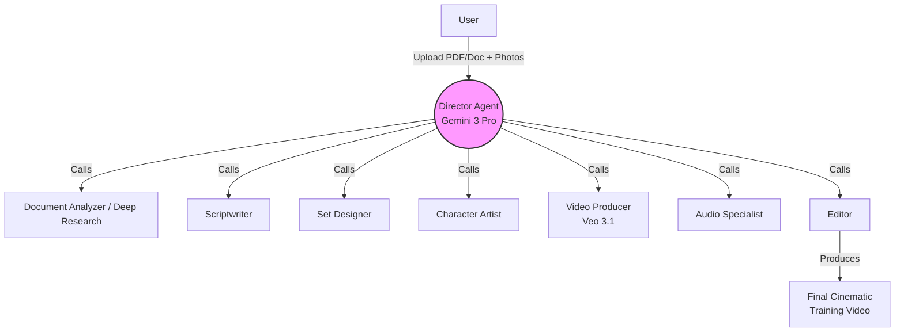
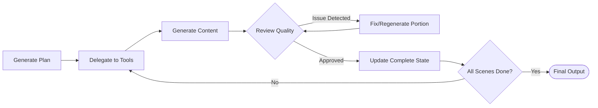
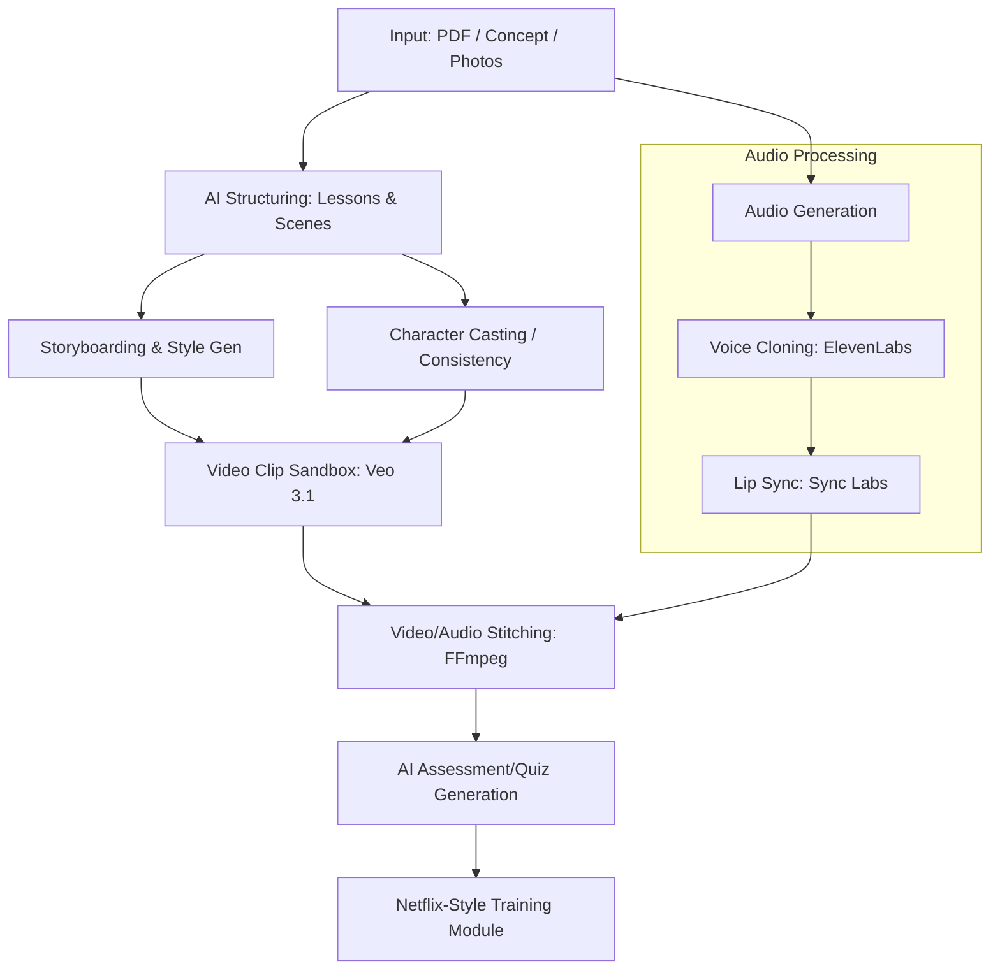

# Neuroflix (Evolution of NeuroReel): Agentic AI Video Production System

An agentic AI video production system that orchestrates a full video production pipeline to transform documents, PDFs, and ideas into multi-scene, cinematic training videos. 

## 🎬 Core Technical Flow

### 1. Input
User uploads a PDF/training document + optional employee photos (multiple angles for consistency).

### 2. Director Agent (Main Orchestrator — Gemini 3 Pro)
- Receives the input.
- Creates a full production plan (number of scenes, style, tone, branding).
- Uses tool calling to manage the entire pipeline (this involves 25+ calls — planning, delegation, review, retry loops, state management).

### 3. Sub-Agent / Tool Layer
Each is a reusable function the Director calls:
- **Document Analyzer / Deep Research** → Analyzes and expands the document content in real time.
- **Scriptwriter** → Turns dry text into engaging, conversational scripts with scenes and dialogue.
- **Set Designer** → Generates detailed scene descriptions, backgrounds, and props (using image gen like Imagen/Nano Banana or Gemini vision).
- **Character Artist** → Creates or refines consistent character references from uploaded photos.
- **Video Producer** → Calls Veo 3.1 (or equivalent) to generate individual video clips per scene.
- **Audio Specialist** → Generates voiceover and music.
- **Editor** → Reviews clips, adds transitions, ensures timing/lip-sync, and stitches the final video (FFmpeg-like logic).

### 4. Orchestration Magic
The Director doesn't call everything once. It continuously loops: 
`Generate → Review Quality → Fix Issues → Regenerate Specific Parts`
- State is maintained so it knows which scenes are complete.
- Total: 25+ tool calls in one run to ensure high quality outputs.

### 5. Output
- A short, cinematic, multi-scene video (bite-sized for training).
- Consistent characters that look like real employees.
- Natural dialogue, music, and smooth editing.

---

## 🚀 Current Production Version (Neuroflix.sg)
The live product has evolved beyond a pure Google stack for maximum quality:

- **Input**: PDF, deck, notes, or raw idea + team photos.
- **Process**:
  1. Upload content → AI structures it into lessons/scenes.
  2. Cast characters (upload photos → consistent appearance across scenes).
  3. Generate storyboard + branded style.
  4. Multi-scene video generation (Veo 3.1 for clips).
  5. Voice cloning (ElevenLabs) + lip-sync (Sync Labs).
  6. Stitching with FFmpeg.
  7. Add AI assessments/quizzes for retention.
- **Output**: Mobile-first Netflix-style training modules designed for high engagement (aims for 95% retention vs 10% for text).

---

## 🛠 Features Dashboard
- Upload PDF + employee face photos.
- Automatic planning → delegation → iteration → final multi-scene cinematic video.
- Dashboard showing live tool calls and agent progress.
- Output: Short Netflix-style training video with consistent characters and perfect lip-sync.

---

## ⚠️ Key Challenges Solved
Building this pipeline required overcoming these major hurdles:
1. **Maintaining character consistency** across different video generations.
2. **Cost & speed optimization** for Veo calls (expensive for many scenes).
3. **Reliable lip-sync** and audio-video alignment.
4. **Robust error handling** in the 25+ tool call retry loop.
5. **State management** for long-running agent workflows.
